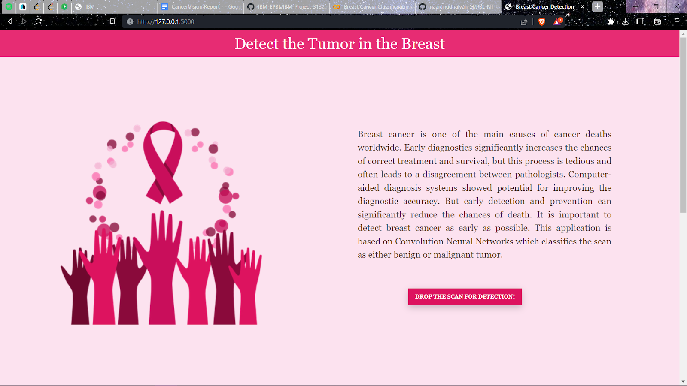
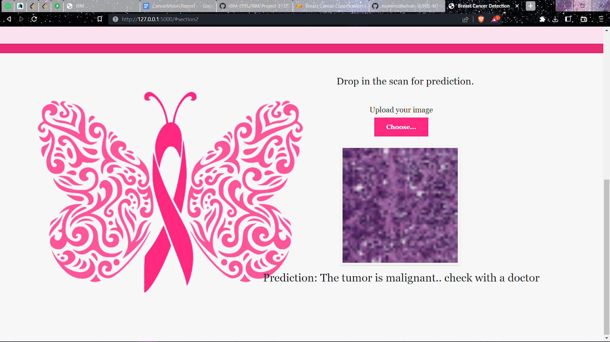

<h1 align=center> CancerVision: Advanced Breast Cancer Prediction With Deep Learning </h1>

### Project Screenshots

---

---

---

### Team Members:

- Eugene Jose Pushpa G : Team Leader 

- Divya S D            : Team Member 1 

- Keerthika K H        : Team Member 2

- Vaishnavi M Y        : Team Member 3

## Project Description :

Breast cancer is one of the most common cancers with a high mortality rate among women. India has witnessed 30% of the cases of breast cancer during the last few years and it is likely to increase.  With the early diagnosis of breast cancer, survival rate will increase from 56% to more than 86%. Therefore, an accurate and reliable system is necessary for the early diagnosis of this cancer can prove helpful for the treatment of patients.  It is necessary to find efficient methods which can help us diagnosis cancer and also to work with various data sets ,that can enable us to produce a more reliable prediction without error.  

Machine learning brings a large contribution on the process of classification and early diagnosis of breast cancer. Tumor cells can either be benign (non-cancerous) or malignant (cancerous).As early diagnostics significantly increases the chances of correct treatment and survival. In this application we are helping the doctors and patients to classify the type of tumour for the specific image given with the help of Neural Networks. 

## Objective :
- To Gain a good understanding of the image data.
- To Know how to pre-process and clean the data using different data pre-processing techniques.
- To Know fundamental concepts & techniques of Convolutional Neural Networks.
- To Know how to build a web application using the Flask framework from python .

## Used Technologies :
  * Tensorflow
  * Keras
  * Flask 

